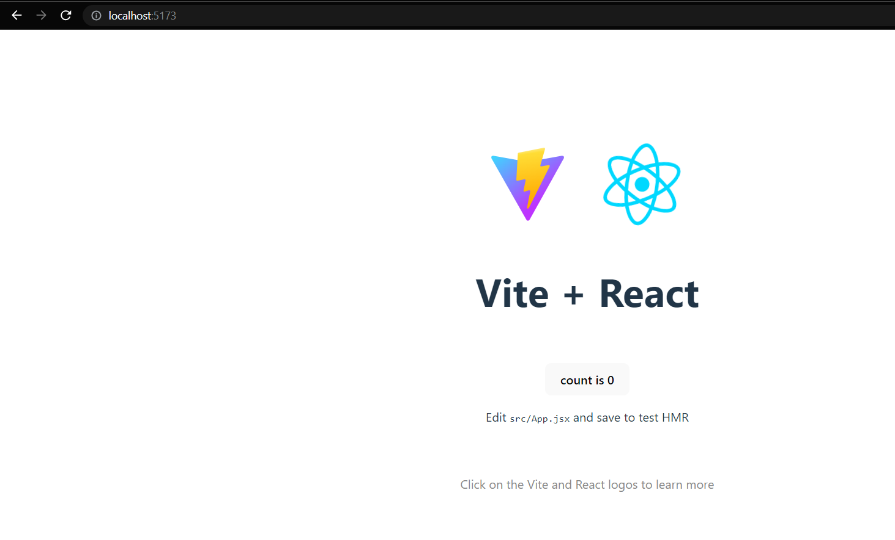
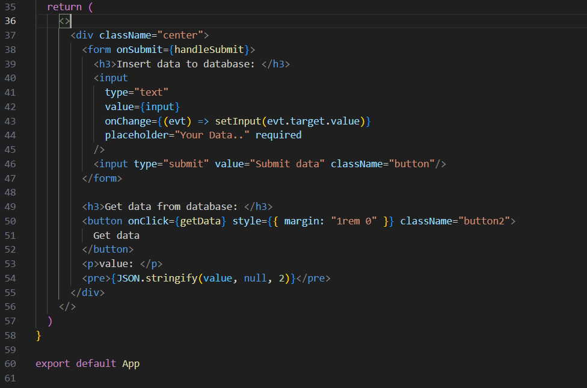
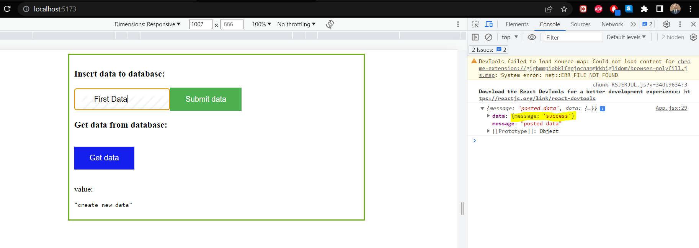
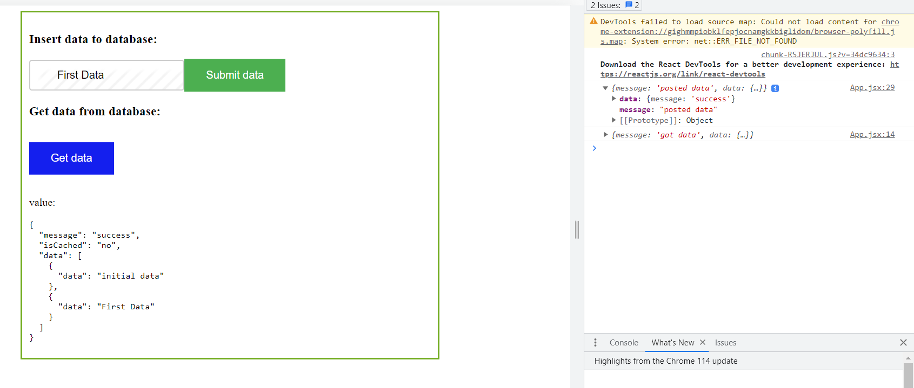
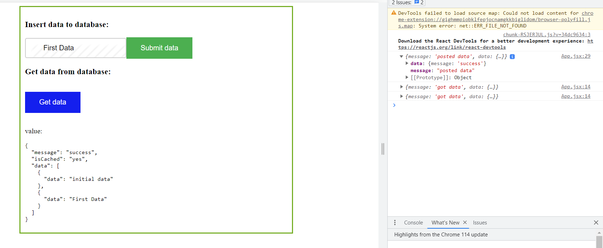

# RapidConnect: Full-Stack Web Application with React, Node.js, Redis, and MySQL

In this project we will develop a full stack application using

1.  React (frontend) a component-based approach and efficient state management
2.  Nodejs (Backend) V8 engine escaped from browser! Extended its capabilities to run JavaScript outside of the browser
3.  Redis (Cache + Pub/Sub) caching capabilities and real-time communication through Pub/Sub.
4.  Mysql Database

The project has two main objectives:

1.  Writing Data to Database:
-   User sends a POST request to the server to write data.
-   The server immediately responds to the client.
-   The server sends to Redis to forward the task to a worker.
-   The server clears the Redis cache memory.
-   The worker writes the data to the database.
1.  Retrieving Available Data from Database:
-   User sends a GET request to the server to retrieve data.
-   The server checks the Redis cache memory for the availability of data.
-   If the data is present in the cache, the server provides the user with the information in JSON format.
-   If the data is not available in the cache:
    -   The server queries the data from the database.
    -   The server updates the cache with the updated data.
    -   The server sends the data to the user in JSON format.

# **Frontend Part**

Let’s begin with a frontend application development using [React](https://react.dev/) App with [Vite](https://vitejs.dev/)

The purpose of this application is:

1.  **Take input form user and POST data to server API.**
    1.  **Send GET request to server and show user fetched JSON data.**

**Set up a React App with Vite**:

Steps:

\> install Node.js

\> create a folder named client-app

\> open a terminal inside the folder

In the terminal now, we will open a React Project.

Check node and npm is installed:

-   node -v
-   npm -v

**Start a Vite project**: npm create vite@latest

Now run:

cd client-app go to vite project directory

npm install install npm

npm run dev starting a development server

The project is now available on localhost 5173 port.

We will remove default configurations of following files from our project:

-   App.css
-   App.jsx
-   Index.css

Now we will see a blank page in the frontend.

Install Axios in the project directory by opening another terminal.

Now, place the scripts for App.css and App.jsx.

We will see the page is now updated like this:

Now, lets take a close look at the App.jsx

We have imported useState hook to dynamically update contents – it is widely used to create interactive and reactive user interfaces. Then we have imported axios library to do our API GET and POST request easily.

We have imported css file which will style the frontend page.

In the line 5 and 6, we have taken two constant variables value, and input using useState hook. This hook provides two parameters of a variable. One is the value itself and another one is a function which is used to update the variable content.

Then we have specified the URL parameters to variables.

Notice the symbol(\`) at time of defining getDataUrl!

We have defined a function getData that will send a HTTP GET request to server using the axios. The function is defined as async mode so that we can get synchronous nature at time of writing JavaScript program.

*‘async’ and ‘await’ simplify working with Promises and provide a more synchronous-like syntax for handling asynchronous operations. The try-catch block allows for more straightforward and centralized error handling. By using ‘await’, any errors thrown during the asynchronous operation will be caught in the ‘catch’ block.*

*Instead of using ‘.then()’ and ‘.catch()’ to handle Promise resolutions and rejections, we can directly assign the resolved value to a variable using ‘await’. When encountering an await expression, the function execution pauses until the awaited Promise is resolved. This allows for sequential execution of asynchronous code, making it easier to reason about the program's logic. This reduces the need for nested callbacks or chained Promises, improving code readability.*

In line 12, after getting a data from get request we have called ‘updateValue’ function to update ‘value’ variable. After passing a console log that we have got our data the function will return the data. If any error occurs during this operation, error message will get logged in the console.

We have defined a ‘handleSubmit‘ function which will take a value as parameter and call ‘createData’ function, and then it will empty the ‘input’ variable content.

In the createData function a post request is performed with the user provided data as ‘inputText’. If any error encounters, the message is logged in the console.

Finally, we have a return block where the frontend content is returned. This block expects single parameter to return, so we have wrapped the whole html content inside \<\>\</\> block. Inside the block a input form is designed with a submit button. When the button is pressed, it will call handleSubmit function with user provided data.

In the GET data portion, when user click the Get data button, ‘getData’ function is called. This function will send GET request to server and update the ‘value’ variable content. In the line 54, the returned JSON value will get printed with 2 indents so that we can see JSON data in pretty format.

NB: The following screenshots expects that the other dependent portions of the project is completed.

POST data:

Get data:

GET response from server after querying data from database. It has updated the Redis cache now with updated data.

Second time GET response from server querying Redis cache:

