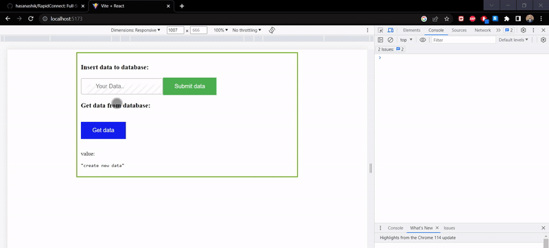
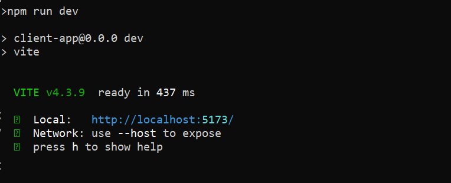
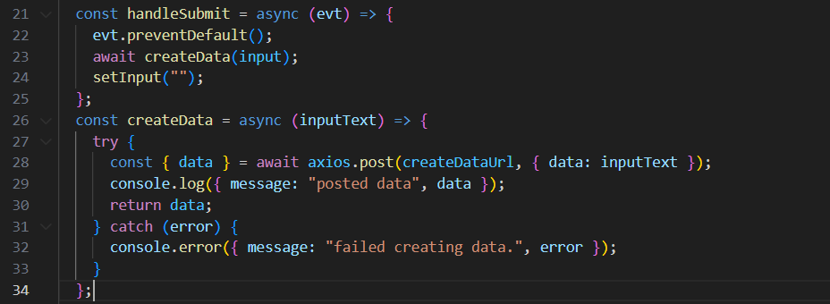
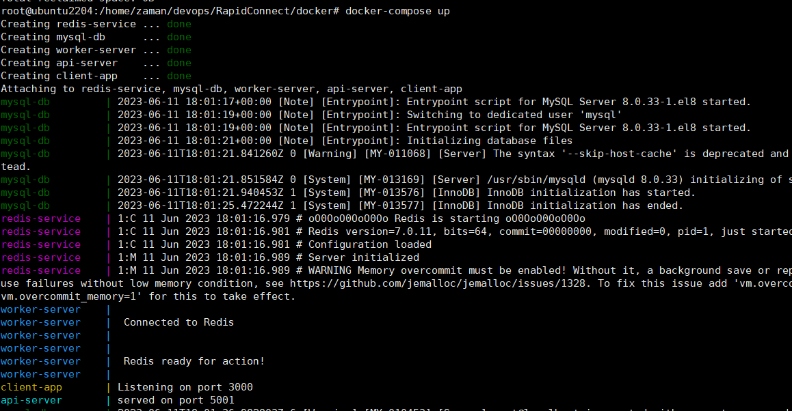
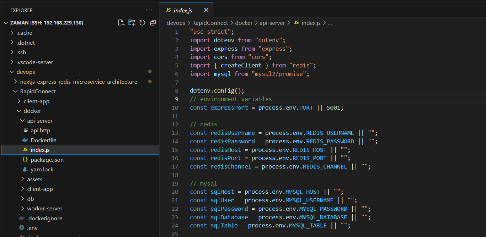
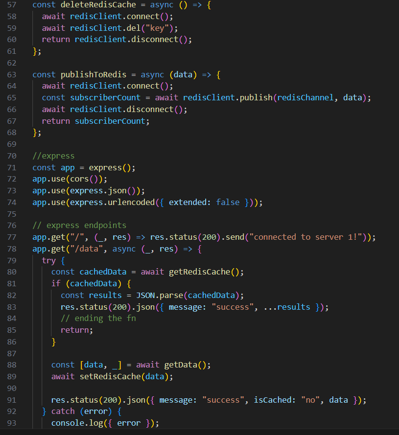
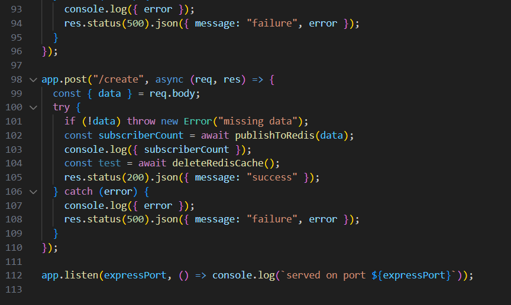
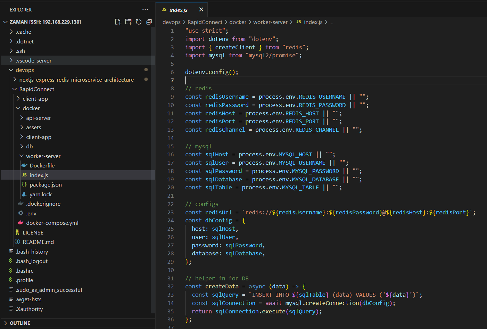
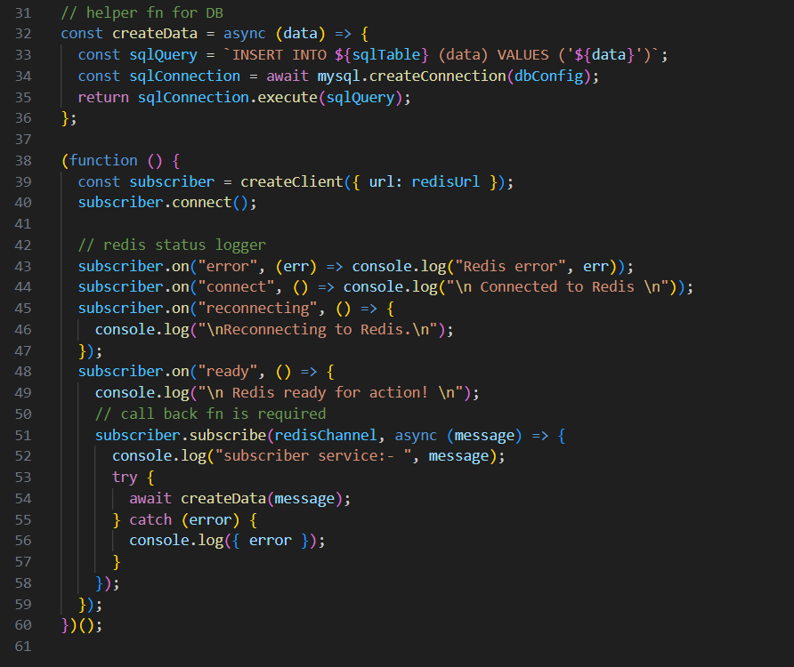
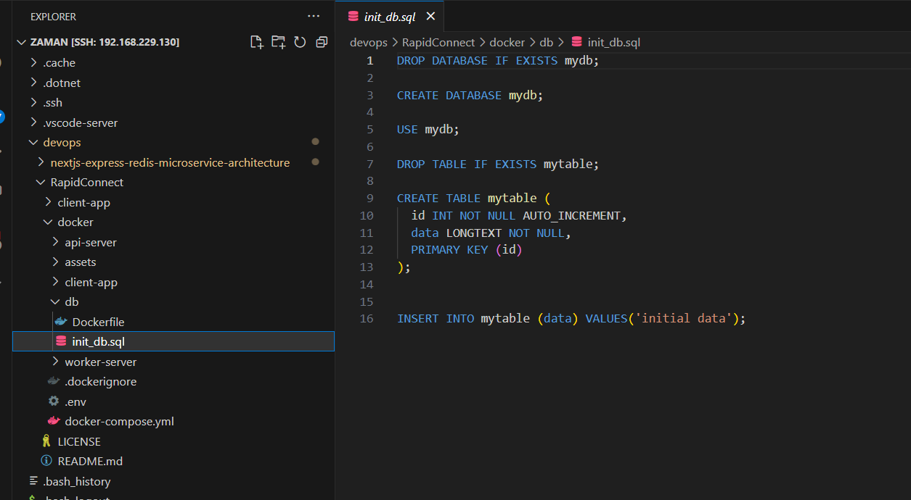

# RapidConnect: Full-Stack Web Application with React, Node.js, Redis, and MySQL

In this project we will develop a full stack application using

1.  React (frontend) a component-based approach and efficient state management
2.  Nodejs (Backend) V8 engine escaped from browser! Extended its capabilities to run JavaScript outside of the browser
3.  Redis (Cache + Pub/Sub) caching capabilities and real-time communication through Pub/Sub.
4.  Mysql Database

The project has two main objectives:

1.  Writing Data to Database:
-   User sends a POST request to the server to write data.
-   The server immediately responds to the client.
-   The server sends to Redis to forward the task to a worker.
-   The server clears the Redis cache memory.
-   The worker writes the data to the database.
1.  Retrieving Available Data from Database:
-   User sends a GET request to the server to retrieve data.
-   The server checks the Redis cache memory for the availability of data.
-   If the data is present in the cache, the server provides the user with the information in JSON format.
-   If the data is not available in the cache:
    -   The server queries the data from the database.
    -   The server updates the cache with the updated data.
    -   The server sends the data to the user in JSON format.

# **Frontend Part**

Let’s begin with a frontend application development using [React](https://react.dev/) App with [Vite](https://vitejs.dev/)

The purpose of this application is:

1.  **Take input form user and POST data to server API.**
    1.  **Send GET request to server and show user fetched JSON data.**

**Set up a React App with Vite**:

Steps:

\> install Node.js

\> create a folder named client-app

\> open a terminal inside the folder

In the terminal now, we will open a React Project.

Check node and npm is installed:

-   node -v
-   npm -v

**Start a Vite project**: npm create vite@latest

Now run:

cd client-app go to vite project directory

npm install install npm

npm run dev starting a development server

The project is now available on localhost 5173 port.

We will remove default configurations of following files from our project:

-   App.css
-   App.jsx
-   Index.css

Now we will see a blank page in the frontend.

Install Axios in the project directory by opening another terminal.

Now, place the scripts for App.css and App.jsx.

We will see the page is now updated like this:

Now, lets take a close look at the App.jsx

We have imported useState hook to dynamically update contents – it is widely used to create interactive and reactive user interfaces. Then we have imported axios library to do our API GET and POST request easily.

We have imported css file which will style the frontend page.

In the line 5 and 6, we have taken two constant variables value, and input using useState hook. This hook provides two parameters of a variable. One is the value itself and another one is a function which is used to update the variable content.

Then we have specified the URL parameters to variables.

Notice the symbol(\`) at time of defining getDataUrl!

We have defined a function getData that will send a HTTP GET request to server using the axios. The function is defined as async mode so that we can get synchronous nature at time of writing JavaScript program.

*‘async’ and ‘await’ simplify working with Promises and provide a more synchronous-like syntax for handling asynchronous operations. The try-catch block allows for more straightforward and centralized error handling. By using ‘await’, any errors thrown during the asynchronous operation will be caught in the ‘catch’ block.*

*Instead of using ‘.then()’ and ‘.catch()’ to handle Promise resolutions and rejections, we can directly assign the resolved value to a variable using ‘await’. When encountering an await expression, the function execution pauses until the awaited Promise is resolved. This allows for sequential execution of asynchronous code, making it easier to reason about the program's logic. This reduces the need for nested callbacks or chained Promises, improving code readability.*

In line 12, after getting a data from get request we have called ‘updateValue’ function to update ‘value’ variable. After passing a console log that we have got our data the function will return the data. If any error occurs during this operation, error message will get logged in the console.

We have defined a ‘handleSubmit‘ function which will take a value as parameter and call ‘createData’ function, and then it will empty the ‘input’ variable content.

In the createData function a post request is performed with the user provided data as ‘inputText’. If any error encounters, the message is logged in the console.

Finally, we have a return block where the frontend content is returned. This block expects single parameter to return, so we have wrapped the whole html content inside \<\>\</\> block. Inside the block a input form is designed with a submit button. When the button is pressed, it will call handleSubmit function with user provided data.

In the GET data portion, when user click the Get data button, ‘getData’ function is called. This function will send GET request to server and update the ‘value’ variable content. In the line 54, the returned JSON value will get printed with 2 indents so that we can see JSON data in pretty format.

NB: The following screenshots expects that the other dependent portions of the project is completed.

POST data:

Get data:

GET response from server after querying data from database. It has updated the Redis cache now with updated data.

Second time GET response from server querying Redis cache:

# Server-App

We will run the server application, Redis, and database portion inside docker using docker-compose. To do this we have installed a ubuntu VM using VMware. Then we have installed the docker-compose using root credentials.

Download the project from git location.

Git clone <https://github.com/hasanashik/RapidConnect.git>

Run ‘*docker remove all containers’* prone to remove previous containers if any to prevent conflicts.

Go to docker directory and run docker-compose up to up redis, mysql, redis and api-server.

NB: If Linux vm ip address changes than we need to replace 192.168.229.130 ip with new ip inside the source code js files.

netstat -tln is showing that necessary ports including 3000, 5001 are opened.

Let us take a look inside our api-server.

In the index.js file first we have called ‘use strict’ to enable writing more reliable, maintainable, and secure JavaScript code.

We have imported dotenv to use environment variables from .env file, express to build our API, cors for sharing resources with other API, Redis for working with PUB/SUB and cache memory. Finally, MySQL for connecting with database.

**dotenv.config()** loads the environment variables from .env file to utilize Redis, MySQL credentials, express port and other parameters.

In line 35, we have created a Redis client using defined Redis URL. A getData function is defined which will execute a database query to fetch data from database.

setRedisCache function is defined which will connect with Redis client and set the cache value as object named ‘key’.

getRedisCache will read that cache value using defined ‘key’ object after making a connection with cache client.

deleteRedisCache wiil free up the ‘key’ object value so that cache memory gets cleared.

If any task is sent to Redis, Redis will assign a worker to do the task and response client immediately that task is submitted. publishToRedis will sent the data to Redis channel to do the task.

So far, we have written all our required functions. Now, we will build the express API in the server to handle client GET, POST requests. If client send GET request in root resource, a log message will be sent to client with 200 status code. If any GET request is sent to ‘/data’ location, it will call a function getRedisCache to collect data from cache. If data exists then client will receive result immediately from response.

If no cache data exists then getData will get called to fetch data from database. It will then update the cache using setRedisCache function.

Client will get the fetched data as a response with 200 status code. If any error occurs during these two steps, error message will gets logged in the console with 500 status code.

To handle client POST request at ‘/create’ URL, data will be separated from POST request and passed to Redis to get written in databse through a worker. The cache will get deleted using deleteRedisCache function.

The server api is launched in the defined expressPort (3000).

# Worker Server

A worker server is build using JavaScript which will take a task from Redis and do the task, in our case it is writing data to database.

To connect with Redis and MySQL database required credentials are loaded from environment and stored in variables.

In line 32, createData function is defined which will connect with MySQL database and execute the query to write user provided data.

Then an immediately-invoked function expression (IIFE) is created which will immediately executed after defining the function. This allows the code within the function to run once without the need for an explicit function call. This function will create Redis client, and subscribe to it. It will not close the connection as worker will always listen to the Redis for any task. When subscriber gets ready event status, it subscribes to Redis channel using subscriber.subscribe(). Whenever any data comes to this channel, it gets written to database using createData function.

# Database-Mysql

A mysql database is prepared using dockerfile.

In the init_db.sql we are dropping mydb if any previous database in this name exists, and creating mydb database. Then, we are creating mytable table with id, data and a primary key as id column. We are also dropping this table before creating new one so that we do not create any conflict.

Finally we are inserting default data in the database as ‘initial data’. When user send a GET request user will see this value fetched from database.
